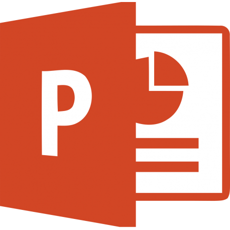

class: coco, inverse

```{r setup, include=FALSE, message = FALSE, warning = FALSE}
knitr::opts_chunk$set(
  echo = TRUE, 
  dev.args=list(bg='transparent', pointsize=10), dev = "svg", 
  fig.width = 5, fig.height = 4)
library(knitr)
library(officer)
library(flextable)
library(fontawesome)
```

.graybackg[

# ArData en 3 points

.center[

.bigtextpp[

Activité de service autour de R


Formations R

Open source : `officer` (remplace `ReporteRs`), `rvg`, `flextable`, `worded`, `mschart`, `gdtools`, `ggiraph`, `fpeek`


]


]

]

---
.leftcol[ 


]

.rightcol[ 

.bigtextclassic[

Production de documents  et 
de présentations  
depuis  avec .

Il a pour prétention d'offrir une solution concurrente à SAS ODS. 

Reporting tabulaire et graphique 

]

]


---

.leftcol[ 

# Par rapport à ReporteRs?

* Contrairement à `ReporteRs`, il n'y a plus besoin de `java`... 
[CRAN Package Check Results for Package ReporteRs](https://cran.r-project.org/web/checks/check_results_ReporteRs.html)

* Plus facile à maintenir - organisé par fonctionnalités à travers 
différents packages

* *tidy-friendly* mais *tidy free* : compatibilité avec R-3.1 (toujours nécessaire?)

]

--

.rightcol[

# Par rapport à R Markdown?


- `officer` est écrit pour générer du `docx` et du `pptx`.

  `rmarkdown` est un framework de *Literate Programming*. 
  
  Reporting tabulaire et graphique &#8800; literate programing

- Les rendus sont meilleurs - selon moi ;)

- Recherche d'une meilleure intégration (via `pandoc 2.0`) afin d'améliorer les rendus

]

---
class: galaxie, inverse

# officer et les packages associés


---

.leftcol[ 

.kindofsubtitle[officer]

  *La colonne vertébrale*

  `r fa("r-project", fill = "#006699")` http://cran.r-project.org/package=officer

  `r fa("book", fill = "#006699")` https://davidgohel.github.io/officer/

.kindofsubtitle[flextable]

  *Le reporting tabulaire et un premier pas vers rmarkdown*

  `r fa("r-project", fill = "#006699")` http://cran.r-project.org/package=flextable

  `r fa("book", fill = "#006699")` https://davidgohel.github.io/flextable/
  
.kindofsubtitle[rvg]

  *Graphiques R vectoriels éditables*

  `r fa("r-project", fill = "#006699")` http://cran.r-project.org/package=rvg

  `r fa("book", fill = "#006699")` https://davidgohel.github.io/officer/
]

.rightcol[ 


.kindofsubtitle[mschart]

  *Graphiques Office natifs*

  `r fa("r-project", fill = "#006699")` http://cran.r-project.org/package=mschart

  Satisfait un **besoin spécifique** : *le consommateur du rapport doit personnaliser mais ne connaît pas R*
  
  `r fa("book", fill = "#006699")` https://ardata-fr.github.io/mschart/

.kindofsubtitle[worded]

  *Un deuxième pas vers rmarkdown*

  `r fa("github", fill = "#006699")` https://github.com/davidgohel/worded

  Permettre une mise en forme Word plus avancée qu'avec le modèle r markdown fourni par RStudio.


]


---
class: inverse, middle

# Illustrations

> voir les fichiers du projet RStudio `r list.files("demo", pattern = "\\.R", full.names = TRUE)`
